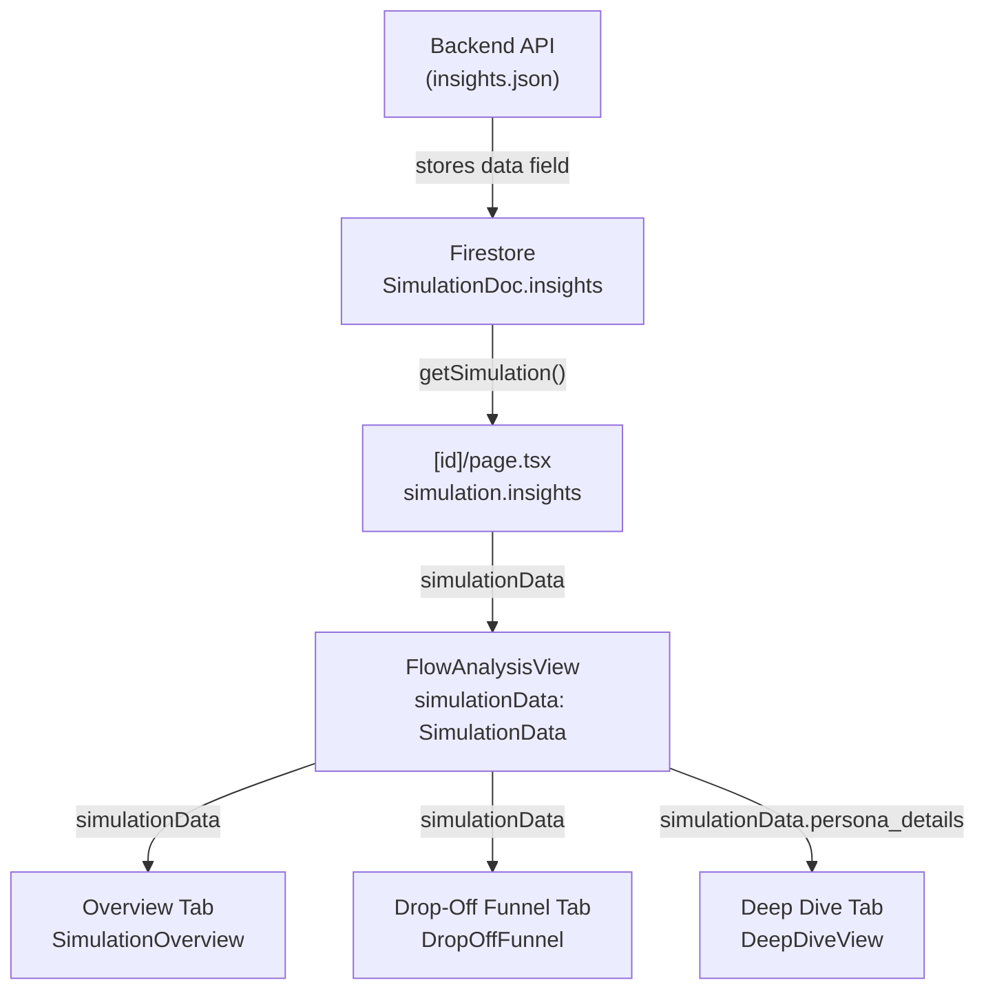

# Wire Dashboard Tabs to API (insights.json)

## What Each Tab Needs from insights.json

All three tabs consume the `data` field inside the insights.json envelope (`{ type: "insights_ready", data: {...} }`). This maps directly to the existing `SimulationData` type in `[src/types/simulation.ts](src/types/simulation.ts)`.

### Tab 1 — Overview

Already typed against `SimulationData`. No structural changes needed.

Fields consumed:

- `flow_name`, `generated_at` → header/footer
- `flow_assessment.overall_verdict` → VerdictBanner
- `summary` (total_personas, completed, dropped_off, completion_rate_pct, avg_time_to_complete_seconds, dominant_plan, dominant_plan_pct) → HeroMetrics
- `sample_quality` (sample_size, margin_of_error_pct, confidence_level, note) → HeroMetrics
- `executive_summary` → ExecutiveSummary
- `top_friction_points[].friction`, `.frequency` → FrictionPoints
- `behavioral_insights[]` → BehavioralInsights
- `design_recommendations[]` (priority, screen, issue, recommendation, expected_impact, primary_affected_segment) → DesignRecommendations
- `flow_assessment.quick_wins[].change`, `.expected_uplift` → QuickWins
- `segment_analysis` (summary, high_propensity_segment, low_propensity_segment) → SegmentAnalysis
- `power_users` (power_user_archetypes[], flow_strengths_for_power_users[], acquisition_recommendation) → PowerUsers

### Tab 2 — Drop-Off Funnel

Already typed against `SimulationData`. No structural changes needed.

Fields consumed:

- `summary.total_personas` → entry count pill
- `funnel_drop_off[]` (screen_id, drop_offs, drop_off_pct) → funnel card list
- `persona_details[]` for the right panel per screen:
  - `demographics.occupation`, `.age`, `.behavioral_archetype`, `.district`, `outcome`, `total_time_seconds`
  - `screen_monologues[]` (screen_id, view_name, internal_monologue, reasoning, emotional_state, trust_score, clarity_score, value_score, time_seconds, friction_points, selected_choice, decision_outcome)

### Tab 3 — Deep Dive

Currently hardcoded to `MOCK_PERSONAS`. Needs to be refactored to accept `simulationData.persona_details`.

Fields consumed (same `PersonaDetail` shape):

- `persona_details[].persona_uuid`, `.demographics` (occupation, age, sex, district, behavioral_archetype, digital_literacy, emi_comfort, first_language), `.professional_background`, `.cultural_background`, `.outcome`, `.total_time_seconds`, `.overall_monologue`
- `persona_details[].screen_monologues[]` (all fields above)
- Filters will change from LAMF Experience/Urgency → **Archetype** (The Pragmatist / The Confused Novice / etc.) + **Digital Literacy** (Low 1–4 / Med 5–7 / High 8–10)

---

## Changes Required

### 1. `[src/lib/firestore.ts](src/lib/firestore.ts)` — Add `insights` field to `SimulationDoc`

```typescript
// Add to SimulationDoc:
insights?: SimulationData;  // populated by backend with insights.json data.data
```

The backend should write `insights.json`'s `data` field here when simulation completes.

### 2. `[src/app/(app)/simulations/[id]/page.tsx](src/app/(app)`/simulations/[id]/page.tsx) — Use real data

Replace:

```typescript
<FlowAnalysisView data={flowAnalysisDummyData} simulationData={sampleSimulationData} />
```

With:

```typescript
const simulationData = simulation.insights ?? null;
<FlowAnalysisView data={flowAnalysisDummyData} simulationData={simulationData ?? undefined} />
```

Show a "Results pending" state when `insights` is null (simulation still processing).

### 3. `[src/components/flow-analysis/FlowAnalysisView.tsx](src/components/flow-analysis/FlowAnalysisView.tsx)` — Thread personas to Deep Dive

Pass `simulationData.persona_details` to `DeepDiveTab`:

```typescript
{activeTab === TAB_DEEP_DIVE && (
  <DeepDiveTab data={data} personas={simulationData?.persona_details} />
)}
```

### 4. `[src/components/flow-analysis/DeepDiveTab.tsx](src/components/flow-analysis/DeepDiveTab.tsx)` — Replace MOCK_PERSONAS

- Accept new prop: `personas?: PersonaDetail[]` (from `@/types/simulation`)
- Replace `MOCK_PERSONAS` with `personas ?? []`
- Pass to `<DeepDiveView personas={personas ?? []} />`

### 5. `[src/components/deep-dive/DeepDiveView.tsx](src/components/deep-dive/DeepDiveView.tsx)` — Update type import + filters

- Change import: `PersonaDetail` from `@/types/flow-analysis` → `@/types/simulation`
- Replace Experience/Urgency filter dropdowns with:
  - **Archetype** filter: derived dynamically from unique `demographics.behavioral_archetype` values
  - **Digital Literacy** filter: Low (1–4) / Medium (5–7) / High (8–10), mapped from `demographics.digital_literacy`

### 6. `[src/components/deep-dive/PersonaView.tsx](src/components/deep-dive/PersonaView.tsx)` and related deep-dive components — Update type import

- Change `PersonaDetail` import from `@/types/flow-analysis` → `@/types/simulation` in all deep-dive components that use it

---

## Data Flow Diagram




---

## Fields NOT currently used (intentionally skipped)

- `playbook_insights` — skipped per your decision
- `completion_analysis.llm_synthesis` — long text, no component for it yet
- `ux_analysis`, `drop_off_analysis.clusters` — components exist but are hidden
- `persona_journeys[]` — not surfaced in any active component
- `addon_adoption`, `plan_distribution` — appear empty in current data, no component

